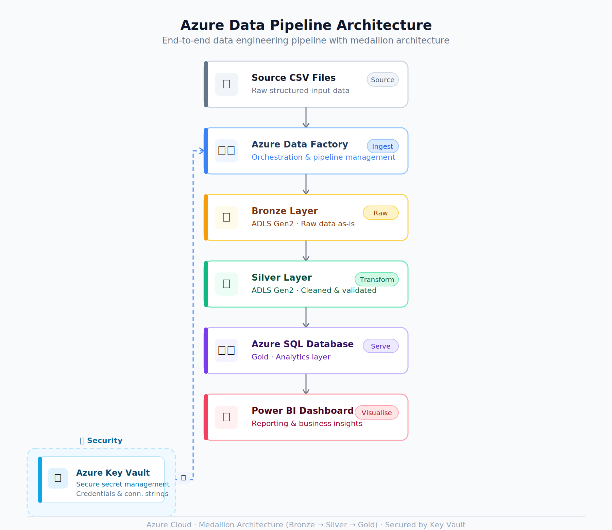
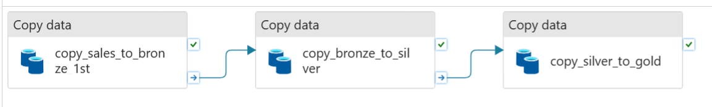
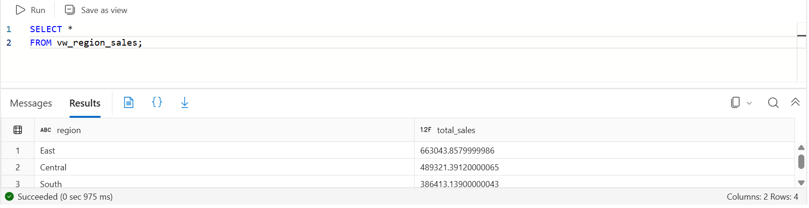
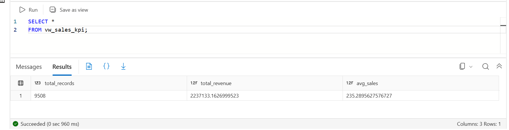
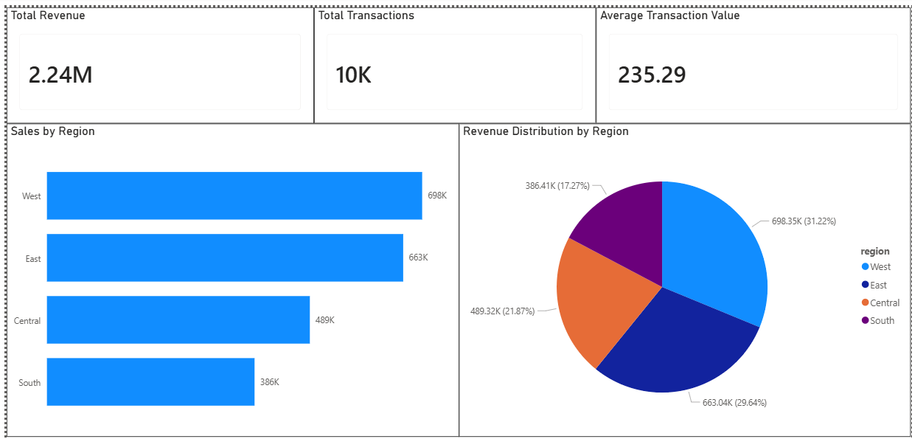

# End-to-End Azure Data Engineering Project – Medallion Architecture

## Project Overview

This project demonstrates an end-to-end Azure Data Engineering solution implementing the Medallion Architecture (Bronze, Silver, Gold) pattern.

The solution ingests raw sales data from CSV files using Azure Data Factory and stores it in Azure Data Lake Storage Gen2. The data is processed through Bronze (raw) and Silver (cleaned) layers before being loaded into Azure SQL Database, which serves as the Gold analytical layer for reporting and business insights.

SQL views are created on top of the curated data to support analytics, and Power BI is used to visualize key business metrics and trends.

The project showcases core Azure Data Engineering concepts including data ingestion, orchestration, parameterization, cloud storage, secret management, SQL analytics, reporting, and source control integration.

---

## Architecture



The solution uses Azure Data Factory for orchestration and data movement, Azure Data Lake Storage Gen2 for Bronze and Silver layers, Azure SQL Database as the Gold analytical layer, Azure Key Vault for secure credential management, and Power BI for reporting and visualization.

---

## Business Objective

The objective of this project is to build a scalable cloud-based data pipeline that:

- Ingests sales data from source files.
- Stores raw data for traceability.
- Processes and organizes data into Medallion layers.
- Uses Azure SQL Database as the Gold consumption layer for analytics and reporting.
- Loads business-ready data into a relational database.
- Generates analytical insights through SQL.
- Visualizes key business metrics using Power BI.

---

# Azure Services Used

## Azure Data Factory (ADF)

Purpose:

- Data orchestration
- Pipeline execution
- Data movement
- Parameterized processing

Features implemented:

- Copy Activity
- Dynamic Pipelines
- Dataset Parameterization
- Pipeline Parameters
- Fault Tolerance
- Debug Runs
- Publish Process
- Git Integration

### Pipeline Implementation



---

## Azure Data Lake Storage Gen2 (ADLS Gen2)

Purpose:

- Centralized cloud storage
- Medallion Architecture implementation

Containers/Folders:

```plaintext
bronze/
silver/
```

---

## Azure SQL Database

Purpose:

- Act as the Gold data layer
- Store curated business-ready data
- Perform analytical queries
- Create reporting views
- Support Power BI reporting
  
---

## Azure Key Vault

Purpose:

- Secure credential management
- Secret storage
- Eliminate hardcoded credentials

Integrated with:

- Azure Data Factory Linked Services

---

## GitHub

Purpose:

- Source control
- Version management
- Collaboration
- CI/CD readiness

Integrated directly with Azure Data Factory.

---

## Power BI

Purpose:

- Business reporting
- Dashboard creation
- KPI visualization

Connected directly to Azure SQL Database.

---

# Medallion Architecture Implementation

## Bronze Layer

Purpose:

Store raw source data without modifications.

Characteristics:

- Exact copy of source files
- Historical preservation
- Landing zone for ingestion

Flow:

```plaintext
Source CSV
      ↓
Bronze Layer
```

---

## Silver Layer

Purpose:

Store cleaned and validated data.

Characteristics:

- Improved data quality
- Structured data organization
- Intermediate processing layer

Flow:

```plaintext
Bronze Layer
      ↓
Silver Layer
```

---

## Gold Layer

Purpose:

Store business-ready curated data for analytics and reporting.

Implementation:

In this project, Azure SQL Database serves as the Gold layer where curated data is loaded from the Silver layer for downstream analytics and dashboarding.

Characteristics:

- Analytics-ready
- Reporting-ready
- Optimized for SQL querying
- Consumed by Power BI dashboards

Flow:

```plaintext
Silver Layer
      ↓
Azure SQL Database (Gold Layer)
      ↓
SQL Views & Analytics
      ↓
Power BI Dashboard
```

---

# Dynamic Pipeline Implementation

To make the solution reusable, dynamic parameterization was implemented.

## Pipeline Parameter

```adf
@pipeline().parameters.file_name
```

Purpose:

Receives file name during pipeline execution.

Example:

```plaintext
sales_output.csv
```

---

## Dataset Parameter

```adf
@dataset().file_name
```

Purpose:

Passes the file name dynamically to the dataset.

Benefits:

- Reusable datasets
- Reduced maintenance
- Supports multiple files

---

# Security Implementation

## Azure Key Vault Integration

Implemented secure credential management by storing secrets in Azure Key Vault.

Benefits:

- No hardcoded passwords
- Centralized secret management
- Improved security posture

---

# Azure SQL Database Integration

Gold layer data was loaded into Azure SQL Database for analytics and reporting.

Table:

```sql
sales_summary
```

---

# SQL Analytics

## View 1: Regional Sales Summary

```sql
CREATE VIEW vw_region_sales AS
SELECT
    region,
    SUM(total_sales) AS total_sales
FROM sales_summary
GROUP BY region;
```

Purpose:

Generate region-wise revenue analysis.

### Regional Sales Analysis



---

## View 2: Sales KPI Summary

```sql
CREATE VIEW vw_sales_kpi AS
SELECT
    COUNT(*) AS total_records,
    SUM(total_sales) AS total_revenue,
    AVG(total_sales) AS avg_sales
FROM sales_summary;
```

Purpose:

Generate key business metrics.

### Sales KPI Analysis



---

# Business Insights Generated

## Total Transactions

```plaintext
9508
```

## Total Revenue

```plaintext
2,237,133.16
```

## Average Transaction Value

```plaintext
235.29
```

## Region-wise Sales

| Region | Total Sales |
|----------|----------:|
| West | 698,354.77 |
| East | 663,043.86 |
| Central | 489,321.39 |
| South | 386,413.14 |

---

# Power BI Dashboard

Dashboard Components:

### KPI Cards

- Total Revenue
- Total Transactions
- Average Transaction Value

### Visualizations

- Sales by Region (Bar Chart)
- Revenue Distribution by Region (Pie Chart)

Purpose:

Provide business users with an interactive view of sales performance.



---

# Project Deliverables

- End-to-End Azure Data Pipeline
- Medallion Architecture Implementation
- Dynamic File Processing
- Secure Secret Management
- Azure SQL Database Integration
- SQL Views and Analytics
- Power BI Dashboard
- GitHub Version Control

---

# Skills Demonstrated

## Azure Data Engineering

- Azure Data Factory
- Azure Data Lake Storage Gen2
- Azure SQL Database
- Azure Key Vault
- Power BI
- GitHub Integration

## Data Engineering Concepts

- ETL / ELT
- Medallion Architecture
- Data Ingestion
- Data Orchestration
- Data Lake Design
- Parameterization
- Fault Tolerance
- Data Movement
- Data Security

## SQL

- Aggregations
- Views
- KPI Calculations
- Analytical Queries

## Version Control

- GitHub Integration
- Branch Management
- ADF Publish Process

---

# Future Enhancements

- Python-based transformations
- PySpark processing
- Azure Databricks integration
- Azure Synapse Analytics integration
- Automated CI/CD deployment
- Data Quality Framework
- Advanced Business Reporting

---

## Repository Structure

```plaintext
Azure-Data-Engineering-Project
│
├── README.md
│
├── sql
│   ├── analytics_queries.sql
│   └── views.sql
│
├── images
│   ├── pipeline.png
│   ├── sql_output.png
│   └── dashboard.png
```

---

## Author

Azure Data Engineering Portfolio Project

Designed and implemented using Azure cloud services following industry-standard Medallion Architecture principles.
